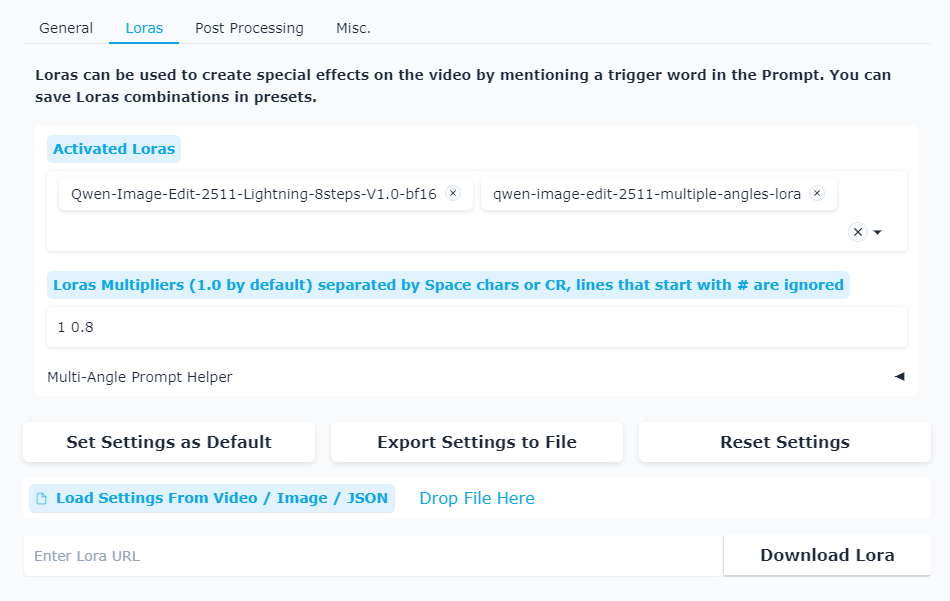
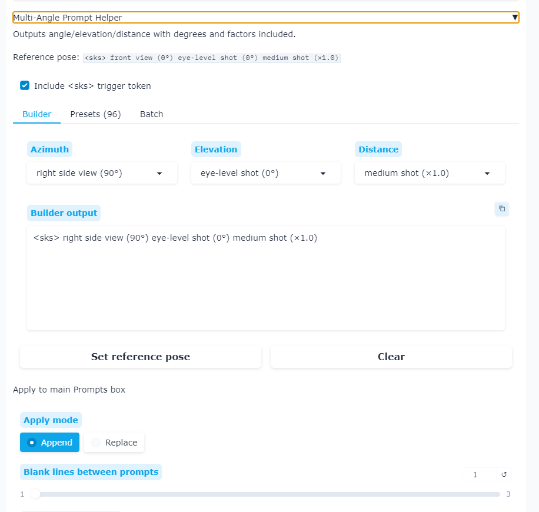
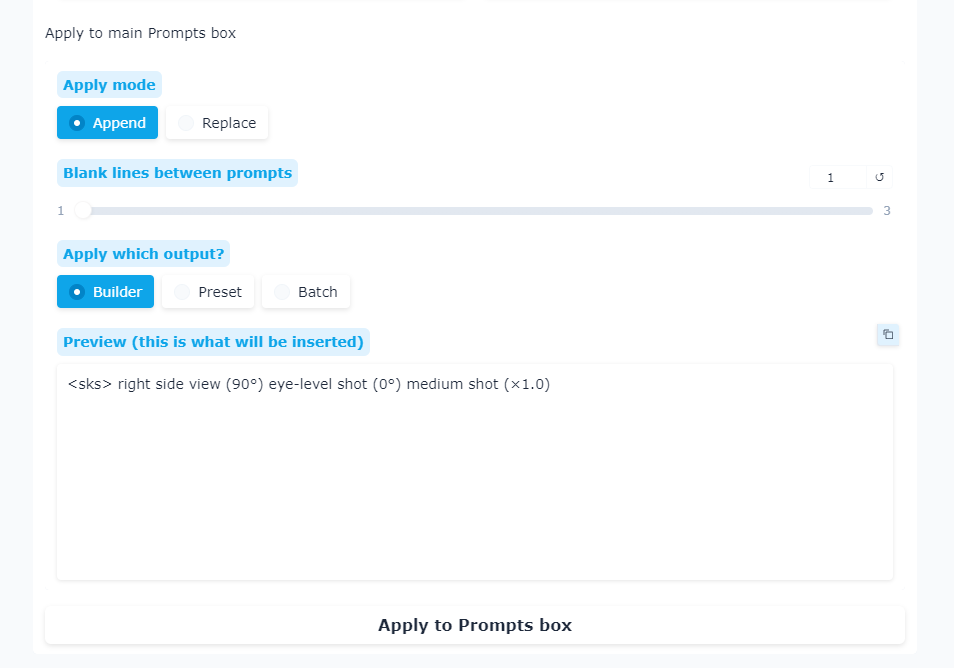

# Multi-Angle Prompt Helper

  A WAN2GP plugin that helps generate multi-angle prompts for 3D-consistent video generation.

  ## Screenshot

  

  ADDS DROPDOWN UNDER LORA MULTIPLIER [Multi-Angle Prompt Helper]

  

  

Core Function is to help automate all the possible poses with the Qwen Image Edit 2511 Multiple angles Lora

  ## Installation

  Copy the `wan2gp-multiangle-prompt-helper` folder into your `plugins` directory.
