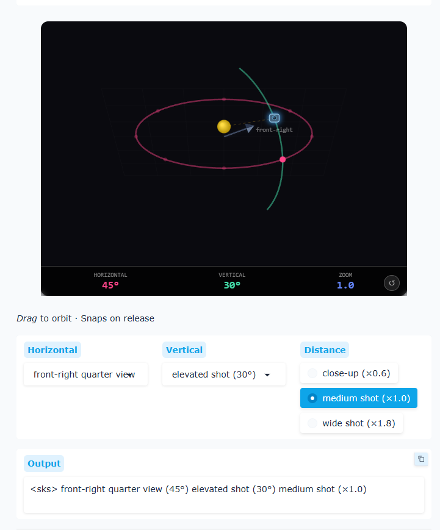

# Multi-Angle Prompt Helper

A [WAN2GP](https://github.com/deepbeepmeep/Wan2GP) plugin for generating multi-angle camera prompts using the Qwen Image Edit 2511 Multiple Angles LoRA. Pick your camera angle with a 3D orbit gizmo, then apply the prompt directly to Video Generator.

### What's new in v2.2

- **LoRA auto-activate** — Clicking "Apply to Prompts & Go to Video Tab" now automatically adds the Multi-Angle LoRA to your active LoRAs with a weight of 1. No more forgetting to select it manually.
- **One-click LoRA download** — A status indicator at the top of the tab shows whether the LoRA is installed. If it's missing, hit the download button and it pulls straight from HuggingFace into `loras/qwen/`.
- **LoRA prerequisites in docs** — New section below with setup instructions for first-time users.

## 3D Orbit Gizmo

Drag the gizmo to set your camera angle visually. The orbit ring shows all 8 horizontal snap points, the green arc shows elevation, and a 3D arrow tracks the current direction. A HUD at the bottom displays the exact horizontal angle, vertical angle, and zoom level.

## How it works

The plugin runs as its own tab in WAN2GP. Pick your angle three ways:

- **Gizmo**: Drag to orbit around the subject. The camera snaps to the nearest preset angle on release.
- **Dropdowns**: Select horizontal (8 angles) and vertical (4 levels) directly.
- **Distance radio**: Switch between close-up, medium, and wide shot.

All three stay in sync. Changing the dropdown updates the gizmo and vice versa.

The Output box shows the formatted prompt string (e.g. `<sks> front-right quarter view (45°) elevated shot (30°) medium shot (×1.0)`). Toggle the `<sks>` trigger token on or off with the checkbox.

## Batch generation

Open the Batch Generation accordion to generate multiple prompts at once:

- 8-view sweep (all horizontal angles, same elevation + distance)
- 4-elevation sweep (all vertical angles, same azimuth + distance)
- 3-distance sweep (all distances, same azimuth + elevation)
- All 96 prompts (every combination)

For batch prompts to queue as separate video requests, enable "Each New Line Will Add A New Video Request" at the bottom of the General Tab in Video Generator.

## Applying prompts

Click "Apply to Prompts & Go to Video Tab" to write the prompt into Video Generator's prompt box and switch tabs automatically. Choose Append or Replace mode, and select whether to apply from the single Output or from the Batch output.

## Prerequisites — Multi-Angle LoRA

This plugin generates prompts for the **[Qwen-Image-Edit-2511-Multiple-Angles-LoRA](https://huggingface.co/fal/Qwen-Image-Edit-2511-Multiple-Angles-LoRA)** by fal.ai. You need to download the LoRA file before the prompts will have any effect.

**Option A — Use the built-in button:** When the LoRA is missing, the plugin shows a "Download Multi-Angle LoRA" button at the top of the tab. Click it and the file is downloaded straight into `loras/qwen/`.

**Option B — Manual download:**
1. Download `qwen-image-edit-2511-multiple-angles-lora.safetensors` from [HuggingFace](https://huggingface.co/fal/Qwen-Image-Edit-2511-Multiple-Angles-LoRA).
2. Place it in your WAN2GP `loras/qwen/` directory.

Once the LoRA is in place, select it in the LoRA picker on the Video Generator tab (Qwen model), then use the prompts from this plugin.

## Installation

Copy the `wan2gp-multiangle-prompt-helper` folder into your WAN2GP `plugins` directory and restart.

## The 96 poses

8 horizontal angles (0° to 315° in 45° steps) x 4 elevation levels (-30° to 60°) x 3 distances (close-up, medium, wide) = 96 total trained poses.

## License

MIT
